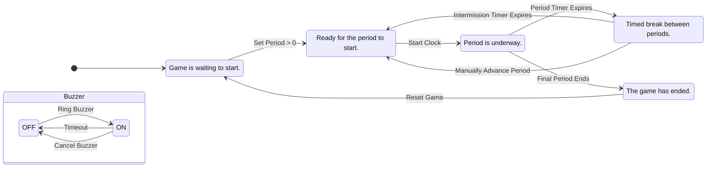

```mermaid
stateDiagram-v2
    direction LR
    [*] --> PRE_GAME
    PRE_GAME: Game is waiting to start.
    PRE_GAME --> READY_FOR_PERIOD: Set Period > 0

    READY_FOR_PERIOD: Ready for the period to start.
    READY_FOR_PERIOD --> IN_PROGRESS: Start Clock

    IN_PROGRESS: Period is underway.
    IN_PROGRESS --> INTERMISSION: Period Timer Expires
    IN_PROGRESS --> GAME_OVER: Final Period Ends

    INTERMISSION: Timed break between periods.
    INTERMISSION --> READY_FOR_PERIOD: Intermission Timer Expires
    INTERMISSION --> READY_FOR_PERIOD: Manually Advance Period

    GAME_OVER: The game has ended.
    GAME_OVER --> PRE_GAME: Reset Game

    state "Buzzer" as Buzzer {
      direction LR
      OFF --> ON : Ring Buzzer
      ON --> OFF : Timeout
      ON --> OFF : Cancel Buzzer
    }
```
