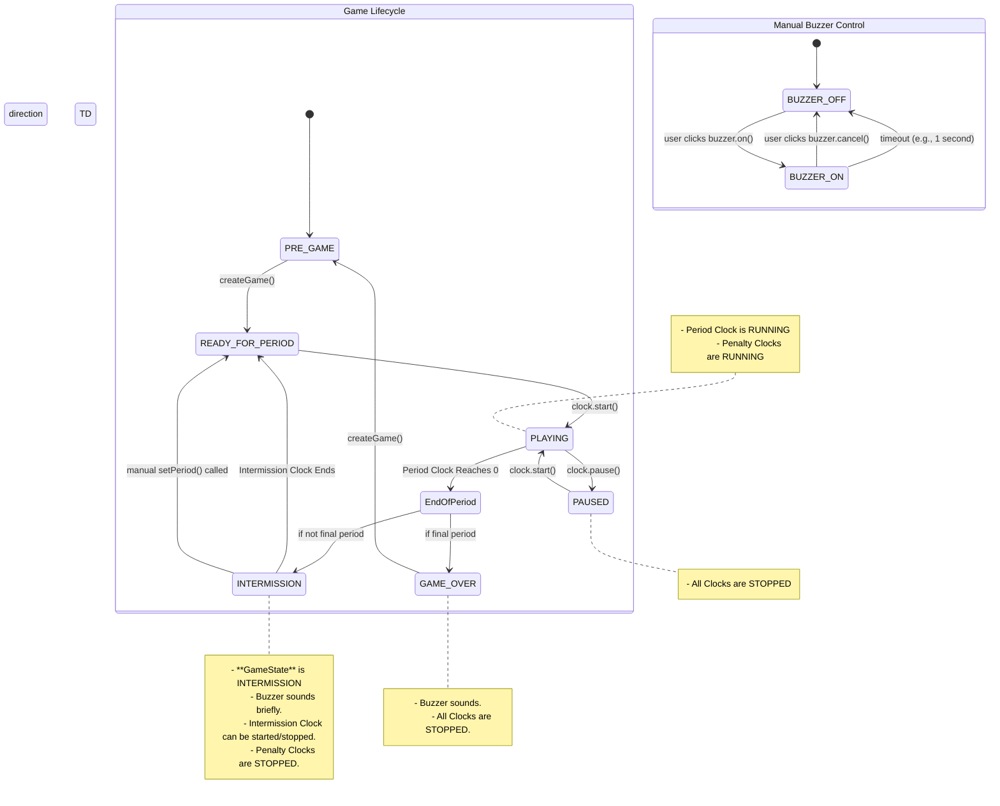

# Scoreboard State Machine

This document outlines the state interactions between the game, clock, period, and buzzer within the hockey scoreboard application.

## Core States

The system revolves around a primary `GameState` that dictates how other components behave.

-   **GameState**: The overall status of the game (e.g., `PLAYING`, `PAUSED`, `INTERMISSION`).
-   **Clock**: Can be `RUNNING` or `STOPPED`. Its behavior depends on the current `GameState`.
-   **Period**: The current period of the game (1, 2, 3, etc.).
-   **Buzzer**: Can be `ON` or `OFF`. It can be triggered automatically by state changes or manually by the user.

## State Interaction Diagram

This diagram illustrates the primary lifecycle of the game and how states transition.

## State Definitions and Interactions

### PRE_GAME
-   **Description**: The initial state before a game is configured. The scoreboard is idle.
-   **Clock**: `STOPPED`
-   **Transitions**: Moves to `READY_FOR_PERIOD` when a new game is created.

### READY_FOR_PERIOD
-   **Description**: The state before the puck drops to start a period. The clock is set with the correct period duration but is not running.
-   **Clock**: `STOPPED`
-   **Transitions**: Moves to `PLAYING` when the user starts the clock.

### PLAYING
-   **Description**: The game is actively being played.
-   **Clock**: The main period clock and any active penalty clocks are `RUNNING` and counting down.
-   **Transitions**:
    -   Moves to `PAUSED` on user action (`clock.pause()`).
    -   Moves to `INTERMISSION` or `GAME_OVER` when the period clock expires.

### PAUSED
-   **Description**: The game is temporarily stopped.
-   **Clock**: All clocks (period and penalty) are `STOPPED`.
-   **Transitions**: Moves back to `PLAYING` when the user resumes the clock (`clock.start()`).

### INTERMISSION
-   **Description**: The state between periods. An optional intermission timer can be run.
-   **Clock**:
    -   The period and penalty clocks are `STOPPED`.
    -   The intermission clock can be started and stopped by the user.
-   **Buzzer**: Sounds automatically for a short duration when this state is entered.
-   **Transitions**:
    -   Moves to `READY_FOR_PERIOD` when the intermission timer expires.
    -   **Critical Fix**: Moves to `READY_FOR_PERIOD` if the user manually changes the period. This prevents the game from getting stuck in the `INTERMISSION` state, which previously caused issues with penalty time calculations.

### GAME_OVER
-   **Description**: The game has concluded.
-   **Clock**: All clocks are `STOPPED`.
-   **Buzzer**: Sounds automatically when this state is entered.
-   **Transitions**: Moves to `PRE_GAME` upon creation of a new game.
