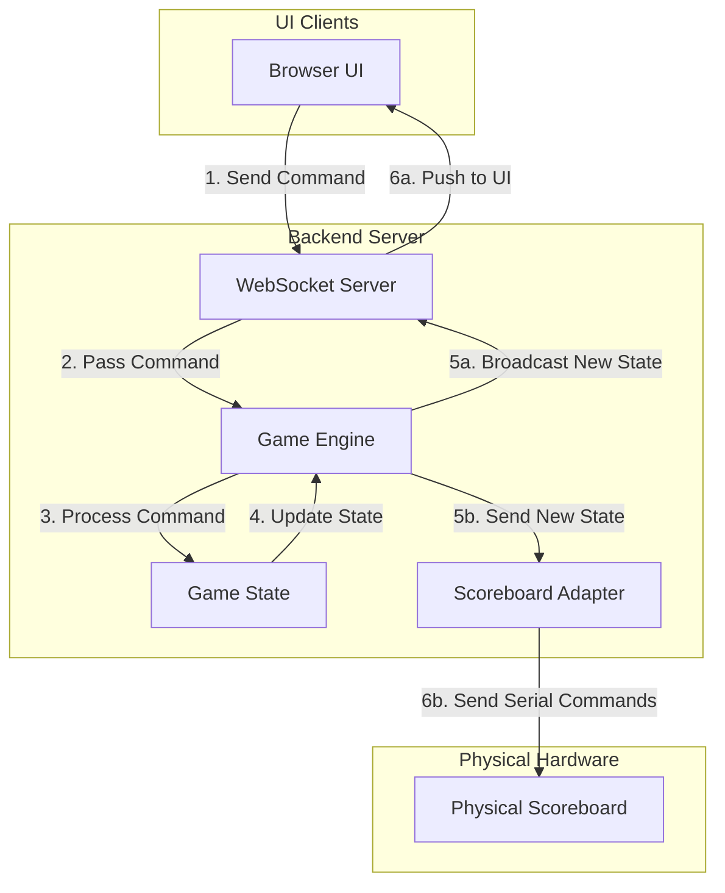
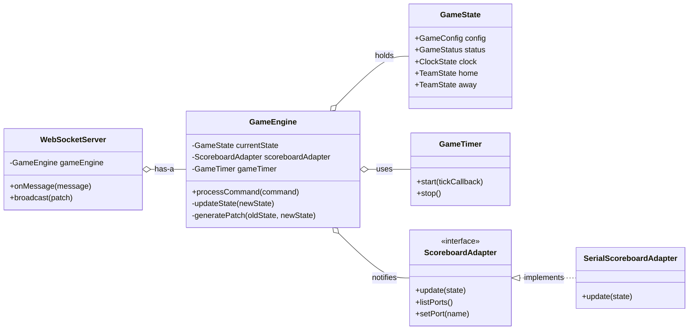

# A Simplified Scoreboard Architecture

This document proposes a revised, simpler architecture for the BIC Scoreboard application. The primary goals of this design are to improve robustness, reduce complexity, and make the system easier to maintain by centralizing state management and standardizing communication.

## Core Principles

1.  **Single Source of Truth (SSOT)**: The Java backend is the absolute authority for all game state. Clients (UI, physical scoreboard) are "dumb" renderers of this state.
2.  **Event-Sourced State**: The game state is modified only in response to explicit, well-defined commands. This makes the system's behavior predictable and easier to debug.
3.  **Unified Communication**: All real-time communication, both for commands and state updates, occurs over a single WebSocket connection. This simplifies the logic on both the client and server.
4.  **Decoupled Clients**: The UI and the physical scoreboard are treated as separate clients that subscribe to state updates. They do not contain business logic.

## Proposed Architecture Diagram

This diagram illustrates the unidirectional data flow of the proposed architecture. Commands flow from the UI to the server, and the resulting state flows back out to all clients.



## Detailed Components & Responsibilities

### 1. UI (TypeScript)
-   **Responsibility**: Render the game state and send user-initiated commands.
-   **Logic**: Contains zero game logic. It holds a local copy of the game state and applies patches as they are received.
-   **Interaction**:
    -   On connection, receives a full `GameState` object and renders the initial view.
    -   For all subsequent updates, it receives a `StatePatch` object and applies it to its local state.
    -   Based on the patch, it efficiently updates only the necessary DOM elements.
    -   User actions are translated into command messages and sent to the WebSocket server.

### 2. WebSocket Server (Java)
-   **Responsibility**: Act as the single message broker for the application.
-   **Logic**: Parses incoming messages to identify commands and passes them to the `Game Engine`. It also manages client subscriptions.
-   **Interaction**:
    -   Listens for `Command` messages from the UI.
    -   Receives `InitialState` and `StatePatch` updates from the `Game Engine`.
    -   Sends updates to all connected UI clients.

### 3. Game Engine (Java)
-   **Responsibility**: The heart of the system. It contains the state machine and all business logic.
-   **Logic**: Its core is a function that looks like `(currentState, command) => newState`. After producing a new state, it compares it with the previous state to generate a patch.
-   **Interaction**:
    -   Receives `Command` objects from the WebSocket Server.
    -   Holds the canonical `GameState` object.
    -   After processing a command, it generates a diff and notifies the `WebSocket Server` with a `StatePatch`. It notifies the `Scoreboard Adapter` with the full new state.

### 4. Scoreboard Adapter (Java)
-   **Responsibility**: Translate the canonical `GameState` into serial commands for the physical scoreboard.
-   **Logic**: Contains a mapping between `GameState` properties and the specific byte sequences the hardware expects.
-   **Interaction**:
    -   It still acts as a subscriber to state updates from the `Game Engine`. For simplicity and robustness, it continues to receive the full `GameState` object, not a patch.
    -   When it receives a new state, it compares it to the last known state and sends the necessary serial commands to update the physical display.

## Performance Optimization: Sending State Deltas

While sending the full state on every update is simple, it can be inefficient. To optimize client performance and reduce network traffic, the server sends only the *changes* (a "delta" or "patch") after the initial connection.

-   **On Connection**: The client receives the full, complete `GameState`.
-   **Subsequent Updates**: The client receives a small `StatePatch` object containing only the keys and values that have changed.

This ensures the client-side UI only needs to update the specific elements of the page that have changed, leading to much better rendering performance.

## Clock Synchronization and Drift Prevention

To ensure the game clock is perfectly accurate and does not drift from real time, the system will not rely on summing up tick deltas. Instead, it will use an authoritative wall-clock-based model.

1.  **On `START_CLOCK`**: The `GameEngine` records the precise system time (`System.currentTimeMillis()`) as `startTimeWallClock` within the `ClockState`.
2.  **On `PAUSE_CLOCK`**: The engine calculates the elapsed time since `startTimeWallClock`, subtracts it from the period's remaining time, and saves the new "frozen" `timeRemainingMillis`. It then clears `startTimeWallClock`.
3.  **The `TICK` Command**: The `TICK` command's payload is now empty. It acts only as a trigger, telling the engine to "re-calculate and broadcast the current time." When a `TICK` is processed, the time displayed is always a fresh calculation based on the current wall clock, making the system immune to drift from server lag or delayed ticks.

This model guarantees that the scoreboard clock is as accurate as the system clock of the machine it's running on.

## Communication Protocol

The protocol is designed to support this optimized, delta-based approach.

#### Client-to-Server: `Command`
This remains the same. A JSON object describing an action the user wants to take.

```json
{
  "type": "COMMAND",
  "command": "START_CLOCK",
  "payload": {}
}
```

#### Server-to-Client: `Initial State` and `State Patch`

**1. Initial State (sent once on connection)**
A JSON object representing the complete, current state of the game.

```json
{
  "type": "INITIAL_STATE",
  "data": {
    "gameState": "PAUSED",
    "period": 1,
    "clock": { "timeRemaining": "20:00", "isRunning": false },
    "home": { "score": 0, "shots": 0, "penalties": [] },
    "away": { "score": 0, "shots": 0, "penalties": [] }
  }
}
```

**2. State Patch (sent for all subsequent updates)**
A JSON object containing only the key-value pairs that have changed. For changes to arrays (like penalties), the simplest robust approach is to send the entire new array.

```json
{
  "type": "STATE_PATCH",
  "data": {
    "gameState": "PLAYING",
    "clock.isRunning": true
  }
}
```
*A few seconds later:*
```json
{
  "type": "STATE_PATCH",
  "data": {
    "clock.timeRemaining": "19:59"
  }
}
```

## Example Flow: End of Period

1.  The `Game Engine`'s internal timer detects the period clock has reached zero.
2.  The engine internally generates an `END_PERIOD` command.
3.  The engine processes the command, producing a `newState` where `gameState` is `INTERMISSION`.
4.  The engine computes a diff between the old and new state, resulting in a patch: `{ "gameState": "INTERMISSION", "clock.isRunning": false, "buzzerOn": true }`.
5.  **UI Client**: The `Game Engine` sends the `StatePatch` to the UI via the WebSocket. The UI applies the patch to its local state and updates only the changed elements (the game status indicator and the buzzer indicator).
6.  **Scoreboard Adapter**: The `Game Engine` sends the complete new `GameState` object to the adapter, which updates the physical board accordingly.

This architecture is simpler and more resilient because components are decoupled and have clear, single responsibilities. The unidirectional data flow makes the application's behavior easy to trace and debug.

---
## Detailed Interaction, Command, and Edge Case Mapping

This section provides a comprehensive blueprint for game configuration, commands, and system reactions, including explicit handling for edge cases.

### Game Configuration (`CREATE_GAME` Command Payload)

When creating a new game, the UI sends a `CREATE_GAME` command with the following payload. This allows for flexible game formats, from standard regulation play to more casual "bender league" rules.

| Parameter | Type | Description | Example |
| :--- | :--- | :--- | :--- |
| `gameType` | `String` | Type of game. Affects default rules. `'REGULATION'` or `'REC_LEAGUE'`. | `'REC_LEAGUE'` |
| `periodLengthMinutes` | `Number` | Duration of each period in minutes. | `14` |
| `intermissionLengthMinutes` | `Number` | Duration of intermission. `0` for no intermission. | `1` |
| `periods` | `Number` | Number of periods in the game. | `3` |
| `clockType` | `String` | Clock behavior. `'STOP_TIME'` (default) or `'RUN_TIME'` for rec leagues. | `'RUN_TIME'` |
| `homeTeamName` | `String` | Name of the home team. | `'Brewers'` |
| `awayTeamName` | `String` | Name of the away team. | `'Steelers'` |

### Game Templates and Configuration

To improve maintainability and ensure consistency, the definition of game templates is moved from the UI to the server. The server will manage a set of predefined game formats (e.g., in a `templates.json` file).

The UI is now only responsible for fetching the list of available templates and sending the user's choice, along with any customizations, to the server.

#### `CREATE_GAME` Command Payload
The payload is now much simpler:

| Parameter | Type | Description | Example |
| :--- | :--- | :--- | :--- |
| `templateId` | `String` | The ID of the server-defined template to use. | `'REC_LEAGUE_14'` |
| `overrides` | `Object` | An object containing any values that override the template's defaults. | `{ "periodLengthMinutes": 15 }` |

The `GameEngine` is responsible for loading the chosen template, applying the overrides, and creating the final `GameConfig` object that will be stored in the `GameState`.

#### Example Server-Side Template Definition (`templates.json`)
```json
{
  "USAH_ADULT_20": {
    "description": "USA Hockey Adult (20 min stop-time)",
    "periodLengthMinutes": 20,
    "intermissionLengthMinutes": 1,
    "periods": 3,
    "clockType": "STOP_TIME",
    "shiftLengthSeconds": null
  },
  "REC_LEAGUE_14": {
    "description": "Recreational League (14 min run-time)",
    "periodLengthMinutes": 14,
    "intermissionLengthMinutes": 1,
    "periods": 3,
    "clockType": "RUN_TIME",
    "shiftLengthSeconds": 90
  }
}
```

### Command Reference

This is the complete set of commands the UI can send to the Game Engine.

| Command | Payload | Description |
| :--- | :--- | :--- |
| **Game Lifecycle** | | |
| `CREATE_GAME` | `{ templateId: string, overrides: object }` | Initializes a new game using a server-side template. |
| `RESET_GAME` | `{}` | Resets the current game state to `PRE_GAME` without changing config. |
| `END_GAME` | `{}` | Manually forces the game into the `GAME_OVER` state. |
| **Clock & Period** | | |
| `START_CLOCK` | `{}` | Starts or resumes the main game clock. |
| `PAUSE_CLOCK` | `{}` | Pauses the main game clock. |
| `SET_CLOCK` | `{ timeMillis: number }` | Manually sets the clock to a specific time. For error correction. |
| `SET_PERIOD` | `{ period: number }` | Manually sets the game to a specific period. |
| `TICK` | `{}` | **Internal command** sent by the `GameTimer` to trigger a time recalculation. |
| **Game Events** | | |
| `ADD_GOAL` | `{ teamId: string, scorerNumber: int, assistNumbers: int[] }` | Adds a goal event, capturing scoresheet details. |
| `REMOVE_GOAL` | `{ goalId: string }` | Removes a specific goal event by its unique ID. |
| `ADD_SHOT` | `{ teamId: string }` | Increments shots on goal for a team by one. |
| `UNDO_LAST_SHOT` | `{ teamId: string }` | Decrements shots on goal for a team by one. |
| `ADD_PENALTY` | `{ teamId: string, playerNumber: int, servingPlayerNumber: int, durationMinutes: number }` | Adds a new penalty to a team. `servingPlayerNumber` can be the same as `playerNumber`. |
| `CANCEL_PENALTY` | `{ penaltyId: string }` | Removes a specific penalty from the game. |
| `UNDO_LAST_EVENT` | `{}` | Reverts the last major state change (goal or penalty). |
| **Hardware & Misc** | | |
| `TRIGGER_BUZZER` | `{}` | Manually sounds the buzzer for its configured duration. |
| `CANCEL_BUZZER` | `{}` | Immediately silences the buzzer if it is sounding. |
| `SET_ADAPTER_PORT` | `{ portName: string }` | Sets the serial port for the physical scoreboard. |
| `START_ADAPTER` | `{}` | Starts sending updates to the physical scoreboard. |
| `STOP_ADAPTER` | `{}` | Stops sending updates to the physical scoreboard. |


### Edge Case Handling

The Game Engine must be resilient to invalid or out-of-sequence commands. The default behavior is to **ignore any command that is not valid in the current state**, with one important exception for post-game corrections. The system should not crash; it should simply discard invalid commands.

#### Post-Game Corrections
A critical real-world scenario is the need to correct errors after a game has officially ended. The `GAME_OVER` state is not a permanent lock. The Game Engine will interpret any state-mutating command (like `SET_PERIOD`, `SET_CLOCK`, or `ADD_GOAL`) received during `GAME_OVER` as an intentional correction by the operator.

Upon receiving such a command, the engine will:
1.  Transition the `gameState` from `GAME_OVER` back to `PAUSED`.
2.  Apply the requested change (e.g., set the period or add the goal).
3.  Broadcast the new state to all clients.

This allows the scorekeeper to seamlessly rewind the game to the correct state, apply the fix, and then either resume play or manually end the game again using the `END_GAME` command.

#### Edge Case Table

| Command | Received During State... | Expected Behavior | Rationale |
| :--- | :--- | :--- | :--- |
| `START_CLOCK` | `PLAYING` | **Ignore.** | The clock is already running. Prevents race conditions. |
| `PAUSE_CLOCK` | `PAUSED`, `INTERMISSION` | **Ignore.** | The clock is already stopped. Ensures idempotency. |
| `ADD_PENALTY` | `INTERMISSION`, `READY_FOR_PERIOD` | **Accept.** | Penalties can be assessed during stoppages. The penalty's timer will not start until play resumes. |
| `SET_PERIOD` | `PLAYING` | **Ignore.** | Cannot change the period while the clock is running. This prevents accidental, destructive changes during live play. |
| `CREATE_GAME` | `PLAYING`, `PAUSED` | **Ignore.** | A game is in progress. `END_GAME` must be called first to prevent accidental game deletion. |
| `SET_PERIOD` | `GAME_OVER` | **Accept.** Reverts `gameState` to `PAUSED` and applies change. | Allows for critical post-game corrections by the operator. |
| `ADD_GOAL` | `GAME_OVER` | **Accept.** Reverts `gameState` to `PAUSED` and applies change. | Allows for critical post-game corrections by the operator. |


### Guaranteed Buzzer Logic

To solve issues where the buzzer gets "stuck" on, the server takes full control of its lifecycle. The UI never sends a "buzzer off" command.

1.  **Trigger**: An event (manual command or period end) triggers the buzzer.
2.  **State Change (On)**: The Game Engine immediately changes the state to `buzzerOn: true`. This is patched to the UI (to show an indicator) and sent to the Scoreboard Adapter (to turn on the physical horn).
3.  **Scheduled Stop**: The Engine simultaneously schedules a "stop" task for the buzzer's duration (e.g., 1.5 seconds).
4.  **State Change (Off)**: When the timer fires, the Engine creates a *new* state change, setting `buzzerOn: false`. This is patched to the UI and sent to the Adapter.

A `CANCEL_BUZZER` command from the UI simply cancels the scheduled "stop" task and immediately triggers the "State Change (Off)" step. This guarantees the buzzer always turns off.

### Granular Interaction Map

| UI Interaction / Event | `Command` Sent (with Payload) | Game Engine Logic | Resulting `StatePatch` | Physical Scoreboard Effect |
| :--- | :--- | :--- | :--- | :--- |
| **Game Setup** | | | | |
| Select template & start | `CREATE_GAME` `{ templateId: 'X', ...}` | Loads template, applies overrides, resets state. Sets `gameState: 'READY_FOR_PERIOD'`. | Full `INITIAL_STATE` object | Clears board, sets period to 1. |
| **Scoring** | | | | |
| Click "Add Goal" (Home) | `ADD_GOAL` `{ teamId: 'home', ... }` | Creates `GoalEvent`, adds to `home.goals`. Recalculates score. Checks penalty/GWG implications. | `{ 'home.goals': [...] }` | Home score digit increments. |
| Click "Remove Goal" | `REMOVE_GOAL` `{ goalId: '...' }` | Finds and removes `GoalEvent` from list. Recalculates score. | `{ 'home.goals': [...] }` | Home score digit decrements. |
| **Shots** | | | | |
| Click "+1 Shot" (Home) | `ADD_SHOT` `{ teamId: 'home' }` | Increments `home.shots`. | `{ 'home.shots': 11 }` | (No effect on most boards) |
| Click "-1 Shot" (Home) | `UNDO_LAST_SHOT` `{ teamId: 'home' }` | Decrements `home.shots`. | `{ 'home.shots': 10 }` | (No effect on most boards) |
| **Penalties** | | | | |
| Click "Start Clock" | `START_CLOCK` `{}` | If `gameState` is valid for start, change to `PLAYING`. Sets `clock.startTimeWallClock` to current time. | `{ "status": "PLAYING", "clock.isRunning": true, "clock.startTimeWallClock": ... }` | Clock begins countdown. |
| Click "Pause Clock" | `PAUSE_CLOCK` `{}` | If `gameState` is `PLAYING`, calculates new `timeRemainingMillis` based on elapsed wall-clock time. Sets `gameState` to `PAUSED`. Clears `startTimeWallClock`. | `{ "status": "PAUSED", "clock.isRunning": false, "clock.timeRemainingMillis": ..., "clock.startTimeWallClock": 0 }` | Clock stops. |
| Clock Ticks | `TICK` `{}` | *(Internal Server Timer)*. Triggers a recalculation of the current time and penalty times based on wall clock. Checks for expired clocks/penalties. | `{ "clock.displayTime": ..., "home.penalties": [...] }` | Clock and penalty times update. |
| Period clock hits 00:00 | *(Internal Server Event)* | On a `TICK`, engine detects time has expired. Generates `END_PERIOD`. Sets `gameState: 'INTERMISSION'`. Triggers buzzer. | `{ "gameState": "INTERMISSION", "clock.isRunning": false, "buzzerOn": true, ... }` | Buzzer sounds. Clock display changes. |

---
## Implementation Details: Data Models and Class Structure

To make the architecture more concrete, this section defines the core data structures and the relationships between the main backend components.

### Data Models

These are the primary Java records or classes that will represent the application's state.

**`GameState.java`**
```java
public record GameState(
    String gameId,
    GameConfig config,
    GameStatus status,
    int period,
    ClockState clock,
    TeamState home,
    TeamState away,
    boolean buzzerOn,
    List<GameEvent> eventHistory // For 'undo' functionality
) {}
```

**`GameConfig.java`**
```java
public record GameConfig(
    String templateId,
    long periodLengthMillis,
    long intermissionLengthMillis,
    int periods,
    ClockType clockType, // Enum: STOP_TIME, RUN_TIME
    Integer shiftLengthSeconds // Optional
) {}
```

**`ClockState.java`**
```java
public record ClockState(
    long timeRemainingMillis, // Frozen time when paused
    boolean isRunning,
    long startTimeWallClock // System.currentTimeMillis() when started, 0 when paused
) {}
```

**`TeamState.java`**
```java
public record TeamState(
    List<GoalEvent> goals,
    int shots,
    List<Penalty> penalties
) {
    // The score is derived from the list of goals, not stored directly.
    public int getScore() {
        return goals.size();
    }
}
```

**`GoalEvent.java`**
```java
public record GoalEvent(
    String goalId,
    String teamId,
    int period,
    long timeInPeriodMillis,
    int scorerNumber,
    List<Integer> assistNumbers, // Max 2
    boolean isEmptyNet
) {}
```

**`Penalty.java`**
```java
public record Penalty(
    String penaltyId,
    String teamId,
    int playerNumber,
    int servingPlayerNumber,
    long durationMillis,
    long timeRemainingMillis, // Frozen time when main clock is paused
    long startTimeWallClock // System.currentTimeMillis() when penalty starts, 0 otherwise
) {}
```

### Class Diagram

This diagram shows the composition of the main backend components. The `GameTimer` is a crucial component that drives the game forward by sending `TICK` commands to the `GameEngine` at a regular interval (e.g., every 100ms). This keeps the `GameEngine` itself pure and free of side effects.


